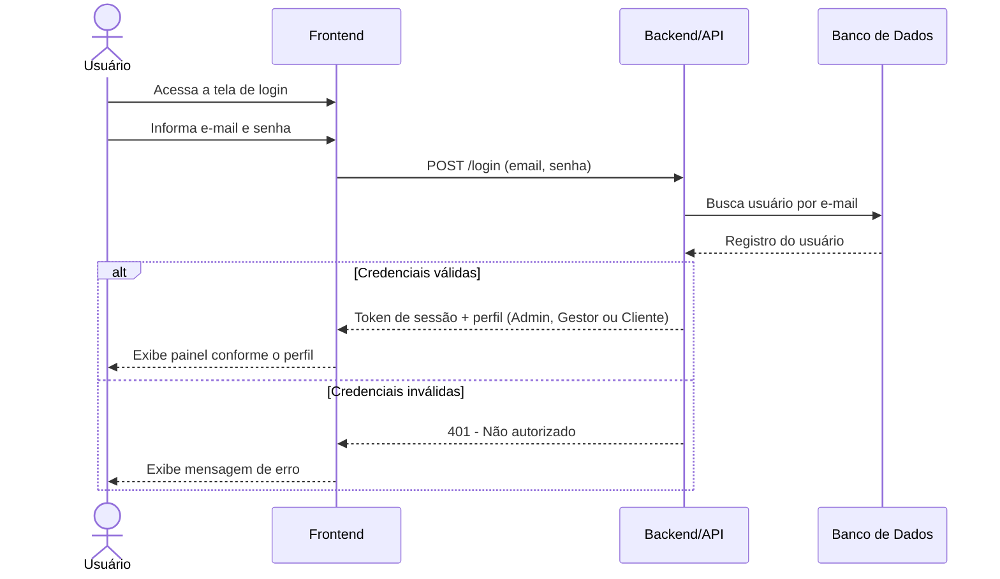
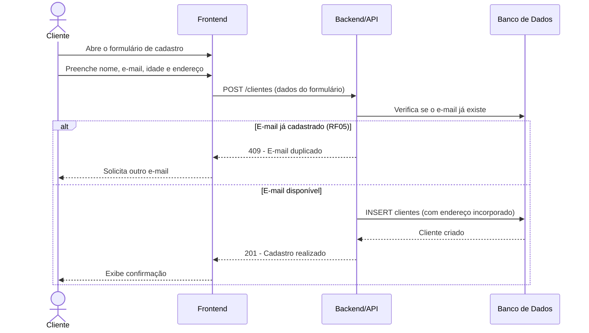
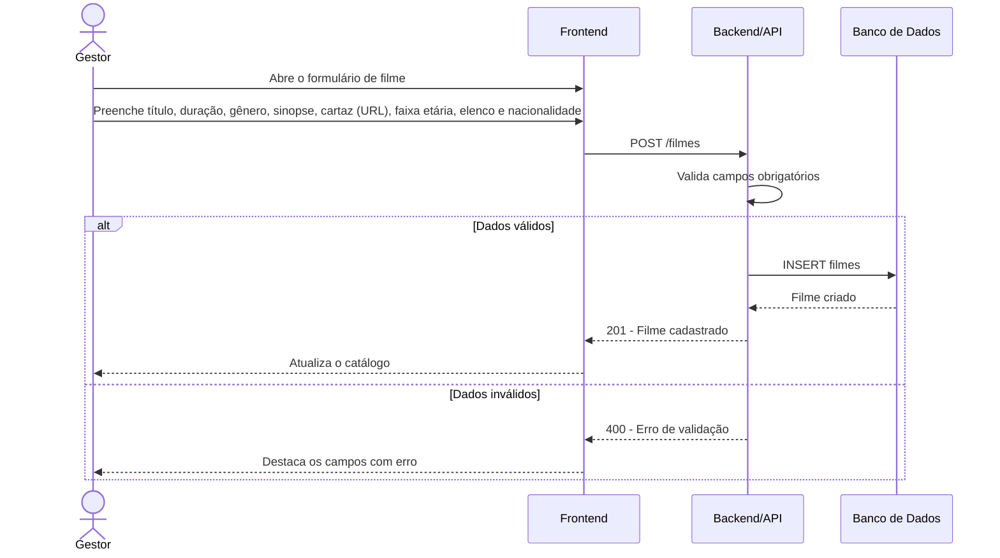
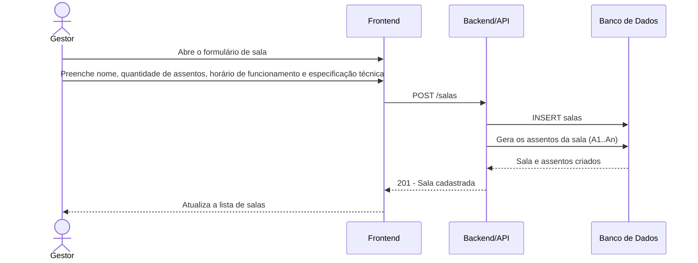
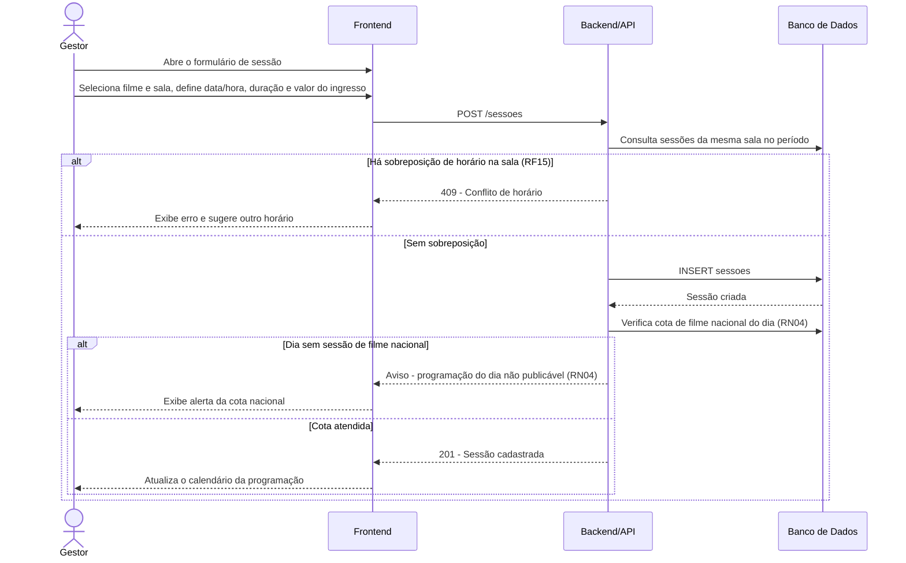
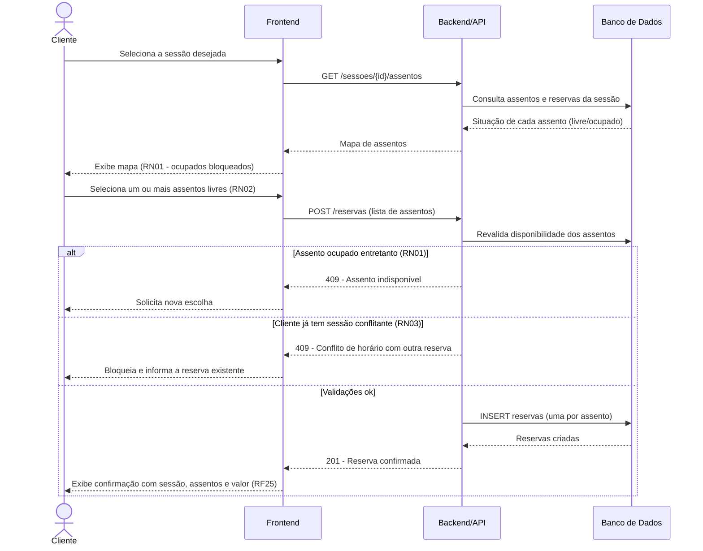
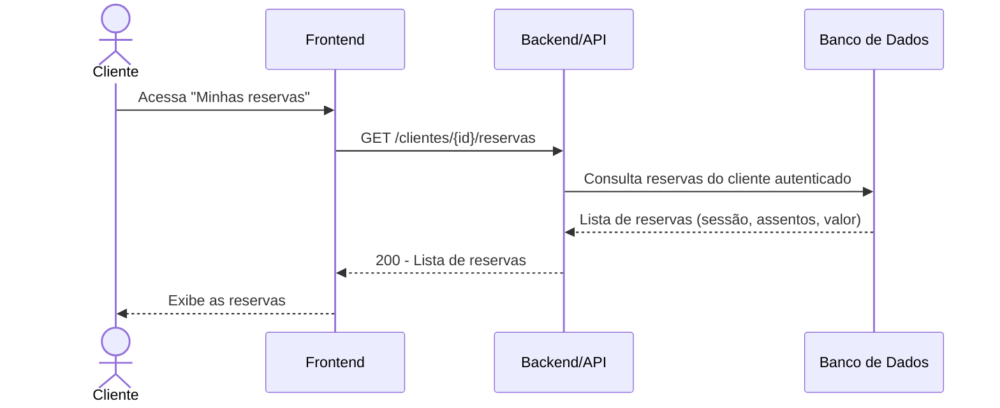
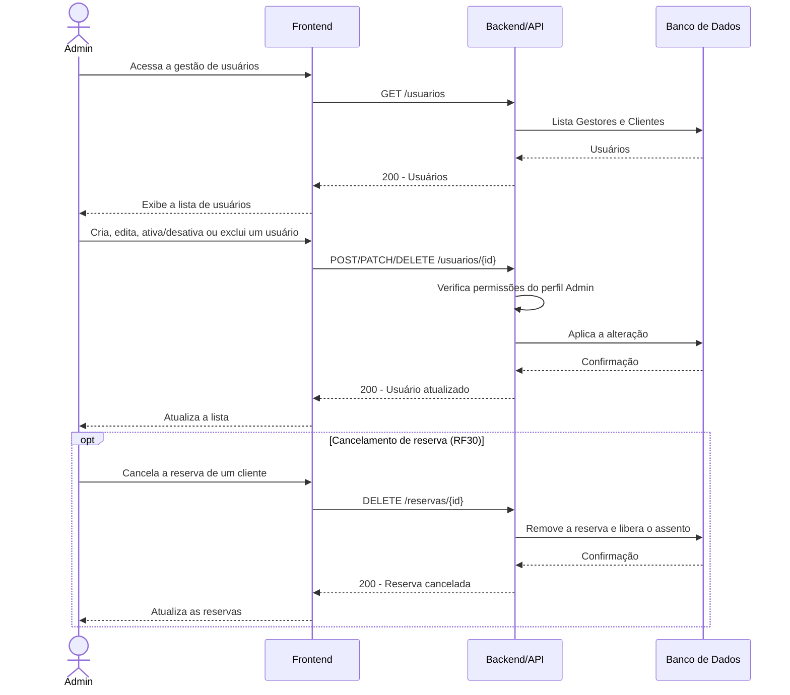

# Fluxos — Diagramas UML de Sequência (Mermaid)

Documentação dos principais fluxos do CineSenac em UML de sequência, renderizada com [Mermaid](https://mermaid.js.org). Os fluxos cobrem os requisitos funcionais ([requisitos-funcionais.md](requisitos-funcionais.md)) e as regras de negócio RN01–RN04.

**Participantes padrão:**

- `U` — Usuário (ator da persona)
- `FE` — Frontend
- `API` — Backend/API
- `DB` — Banco de Dados

## 1. Autenticação (RF01, RF02)

## 2. Cadastro do cliente (RF04, RF05)

## 3. Cadastro de filme (RF08)

## 4. Cadastro de sala (RF11, RF13)

## 5. Cadastro de sessão (RF14, RF15, RN04)

## 6. Reserva de assentos (RF20–RF25, RN01–RN03)

## 7. Consulta das próprias reservas (RF26)

## 8. Gestão de usuários (Admin) (RF27, RF30)

## Cobertura

| Fluxo | Requisitos | Regras de negócio |
|---|---|---|
| 1. Autenticação | RF01, RF02 | — |
| 2. Cadastro do cliente | RF04, RF05 | — |
| 3. Cadastro de filme | RF08 | RN04 (nacionalidade) |
| 4. Cadastro de sala | RF11, RF13 | — |
| 5. Cadastro de sessão | RF14, RF15 | RN04 |
| 6. Reserva de assentos | RF20–RF25 | RN01, RN02, RN03 |
| 7. Minhas reservas | RF26 | — |
| 8. Gestão de usuários | RF27, RF30 | — |
